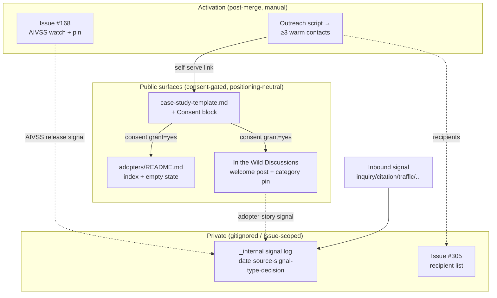

---
triad:
  pm_signoff:
    agent: product-manager
    date: 2026-06-01
    status: APPROVED_WITH_CONCERNS
    notes: "0 BLOCKING / 0 HIGH / 1 MEDIUM / 3 LOW. All 7 areas PASS: every spec FR-001..012 + 5 US map to Components+Build-Phases (zero dropped); scope 1:1 with spec/PRD (README cross-link stays a one-liner); SC-010 stays exogenous (F-3 closes on endogenous SC-001..009); NFR-1 enforced by Phase-B pre-merge acceptance gate + consent-default-deny; NFR-2 verified EMPIRICALLY across plan + supporting docs + live Step-6 append target (every commercial-vocab match in guard/out-of-scope/neutral-enum framing = zero leak); M-1 pin-mechanic resolved in D1 (live-verified 3/4 global pool), M-2 outreach-tail reflected in Phase E; D6 feat(305): + post-merge release verification preserved (PR #306 title already prefixed). MEDIUM = plan->tasks sequencing (>=3 sends is an endogenous close-item executing in the post-merge tail -> make discrete owner-assigned tasks with a hard recipients-logged-in-#305 check). L-1 outreach script single-source, L-2 .gitignore line-cite approx, L-3 add Step-6 architecture README to Phase-B scan scope (FOLDED into Phase B). Full review .aod/results/product-manager.md."
  architect_signoff:
    agent: architect
    date: 2026-06-01
    status: APPROVED_WITH_CONCERNS
    notes: "0 BLOCKING / 0 HIGH / 1 MEDIUM / 3 LOW. All 8 mandated items VERIFIED against the live repo + GitHub API: D1 pin-mechanic (global pins 3/4 = #176/#177/#178; global + per-category pools independent at 4 each -> category-level pin preserves the last global slot; #168 issue pin 0->1/3), D4 signal-log subsection genuinely distinct from the existing 2-condition re-eval table + canonical _internal home (KB8 L1), NFR-2 .gitignore:198 + 0 tracked files (structurally guaranteed), FR-012 no-ADR (ADR-044 no-code precedent), D8 docs/adopters absent from tachi-pytest.yml paths + manifest + init-baseline-tree (no baseline regen), contracts/ + agent-context N/A correct, data-flow sound+complete. MEDIUM-1 (FOLDED into Phase B): Step-6 auto-append would publish the Data-Flow private nodes (_internal log + Issue-#305 recipient) into the PUBLIC 01_system_design/README.md -> abstract private nodes out of the published Data Flow + add the file to the FR-008/009 scan; no buyer-signal/BLP-03 framing may cross. L-1 signal-log own heading, L-2 recipient=already-public-handles-only, L-3 README augment-not-duplicate (all folded). Full review .aod/results/architect.md."
  techlead_signoff: null  # Added by /aod.tasks
---

# Implementation Plan: Adoption Signal Capture (F-3, BLP-04 Wave 3)

**Branch**: `305-adoption-signal-capture` | **Date**: 2026-06-01 | **Spec**: [spec.md](./spec.md)
**Input**: Feature specification from `specs/305-adoption-signal-capture/spec.md`

## Summary

Build the **receiving infrastructure** for adoption signals: an adopter case-study template (with a required consent block), a `docs/adopters/` index, reuse of the existing "In the Wild" GitHub Discussions category (welcome post + category-level pin), a warm soft-outreach round (≥3 previously-engaged contacts), an AIVSS v1.0 release watch on Issue #168, and a gitignored internal append-only signal log. The deliverable is **infrastructure, not content** — actual case-study text and outreach responses are exogenous. Technically this is **markdown + GitHub platform configuration only**: no application code, no schema change, no new ADR. The dominant constraints are privacy/consent (default-private, publish-on-consent) and positioning neutrality (no commercial framing in any public surface).

## Technical Context

**Language/Version**: N/A — deliverables are Markdown documents + GitHub platform configuration (Discussions, Issues, pins). No programming language.
**Primary Dependencies**: GitHub Discussions (existing "In the Wild" category), GitHub Issues (#168, #305), `git`/`.gitignore`. No package dependencies.
**Storage**: Files in the repo (`docs/adopters/`, `CHANGELOG.md`) + one gitignored file (`_internal/strategy/BLP-03-signed-updates.md`). No database.
**Testing**: Docs-only DoD (Constitution Principle VII §Exceptions) — manual inspection + post-merge verification. No automated test suite applies (see Constitution Check). `waves_tested: 0` with explicit `skip_reason` recorded at build (KB Entry 4).
**Target Platform**: GitHub.com (repo docs + Discussions/Issues) rendered markdown.
**Project Type**: Documentation + platform-config (single feature branch).
**Performance Goals**: N/A.
**Constraints**: (1) Privacy/consent — no adopter identity published without an explicit grant; recipient list private to Issue #305. (2) Positioning neutrality — no commercial/pricing/competitor/buyer-signal framing in any public artifact. (3) Repo cleanliness — `_internal/` never appears in `git status` for a public commit (structurally guaranteed: `.gitignore:198`, 0 tracked files).
**Scale/Scope**: 2 new public docs (`case-study-template.md`, `README.md`), 1 CHANGELOG entry, 1 gitignored signal-log subsection, ~4 GitHub platform actions, ≥3 outreach messages.

## Constitution Check

*GATE: Must pass before Phase 0. Re-checked after Phase 1 (below).*

| Principle | Gate | Status |
|-----------|------|--------|
| VII — Definition of Done (NON-NEGOTIABLE) | DoD applies to all tiers | **PASS via §Exceptions** — "Documentation-only changes may not require production deployment." Maps to manual inspection + post-merge verification; `waves_tested: 0` + `skip_reason` recorded in `test-results/summary.json` (KB Entry 4). Not a silent skip. |
| IX — Git Workflow & Feature Branching (NON-NEGOTIABLE) | Feature branch + PR | **PASS** — on `305-adoption-signal-capture`; draft PR #306 open; squash-merge to main. |
| X — Product-Spec Alignment (NON-NEGOTIABLE) | PM + Architect sign-off on plan | **In progress** — this plan's dual sign-off (Step 3). |
| V — Privacy & Data Isolation | No data leakage | **PASS** — adopter identities consent-gated; signal log gitignored; recipient list private. |
| Standard governance tier | PM+Arch plan gate + triple-signoff tasks | **Active** — standard tier (constitution default). |

**No code-oriented gates apply** (no API, no DB schema, no concurrency, no auth) — this feature introduces no application code (FR-012). No constitution violations → no Complexity Tracking entries needed.

## Project Structure

### Documentation (this feature)

```
specs/305-adoption-signal-capture/
├── plan.md              # This file
├── research.md          # Research (authored at spec stage; covers plan Phase 0)
├── data-model.md        # Entity field schemas (case study, signal-log entry, recipient, AIVSS watch)
├── quickstart.md        # How to submit / how to log a signal / how to verify deliverables
├── spec.md              # PM-approved specification
├── checklists/
│   └── requirements.md  # Spec quality checklist
└── tasks.md             # (/aod.tasks output — next sub-step)
```

> **contracts/ — intentionally omitted (N/A)**: this feature exposes no API surface. The only "contracts" are the case-study template field schema and the signal-log entry schema, both captured in `data-model.md`. Creating a `contracts/` directory would duplicate that with no consumer.

### Repository artifacts (what this feature creates/edits)

```
docs/adopters/
├── case-study-template.md     # NEW — FR-001/FR-002 (required sections + Consent block)
└── README.md                  # NEW — FR-003 (index + "How to submit" + empty state)

CHANGELOG.md                   # EDIT — FR-007 (feat(305): entry under BLP-04 Wave 3 heading)
README.md                      # EDIT (optional, one line) — AUGMENT the existing §Community "In the Wild" line to also point at docs/adopters/ (Architect LOW-3: do NOT add a duplicate In-the-Wild link)
docs/architecture/01_system_design/README.md  # EDIT (auto-gen, Step 6) — Feature 305 component map (PRIVACY-ABSTRACTED: private _internal log + Issue-#305 recipient nodes excluded from the published Data Flow; no BLP-03/buyer-signal framing)

_internal/strategy/BLP-03-signed-updates.md    # EDIT (GITIGNORED, never committed) — FR-006 signal-log subsection

# Outreach script: in-repo at docs/adopters/ OR Issue-tracked (decided below: Issue-tracked to keep public docs adopter-facing)
```

**Structure Decision**: Single feature branch. New public docs live under a new `docs/adopters/` directory (greenfield — verified absent). The internal signal log extends the **canonical** `_internal/strategy/BLP-03-signed-updates.md` (KB Entry 8 Lesson 1 — never a `docs/`-side copy). No `src/`, no `tests/` — there is no application code.

## Components

- **Case-study template** (`docs/adopters/case-study-template.md`): the structured submission form. Required sections (org/identifier, scale, integration point, capabilities used, outcomes) + optional (logo, pull-quote, public-reference link) + a **required Consent block** (publish name? / use logo? / attribution+contact) capturing consent at submission.
- **Adopters index** (`docs/adopters/README.md`): the discovery surface — lists accepted case studies (empty state at launch) and a "How to submit" pointer routing to the template and the "In the Wild" channel.
- **Adopter-stories channel** (GitHub Discussions → existing "In the Wild" category): the public peer-signal surface. A welcome post (category-level pinned) links to the template and index; the category description is updated to point to the submission path.
- **Outreach script + round**: a short warm-follow-up message template (soft "here's what shipped", no CTA) sent to ≥3 previously-engaged contacts; recipients logged privately in Issue #305.
- **AIVSS watch** (Issue #168): a partial-scope tracking comment (watch only; evaluation is a separate future initiative) + an issue pin.
- **Internal signal log** (gitignored `_internal/strategy/BLP-03-signed-updates.md`): an append-only ledger recording each inbound adoption signal in a uniform shape (date · source · signal-type · decision) for maintainer tracking.
- **CHANGELOG entry**: the release-visibility record (`feat(305):`).

## Data Flow



**Key invariants**: (1) No adopter identity flows to a Public surface without a consent grant captured in T. (2) The recipient list (R) and signal log (L) never enter a public commit. (3) No commercial framing crosses from L into any Public surface.

## Tech Stack

- **Markdown** — all in-repo documents (GitHub-rendered).
- **GitHub Discussions** — existing "In the Wild" category; category-level pin + category description (no new category, no new platform capability).
- **GitHub Issues** — #168 (AIVSS watch comment + issue pin), #305 (close-out + private recipient list).
- **git + .gitignore** — `_internal/` exclusion (line 198) keeps the signal log out of every commit.
- **No build tooling, no runtime, no dependencies.**

## Phase 0: Decisions (research consolidated)

Phase 0 research is complete and recorded in [research.md](./research.md) (KB, codebase, architecture, and web findings; authored at spec stage and covering plan needs). All would-be `NEEDS CLARIFICATION` items are resolved below. No unresolved markers remain.

**D1 — Q5 Pin mechanic (Architect decision; resolves PM M-1)**
- **Decision**: Pin the welcome post with a **category-level pin inside "In the Wild"** (which has its own independent 0/4 pin pool) and **update the "In the Wild" category description** to point to the template + index. Use an **issue pin** for #168 (issue-pin pool 0/3). Do **not** consume a global discussion-pin slot.
- **Rationale**: GitHub's global and per-category pinned-discussion pools are independent (4 each — verified via docs + live API). The global pool is at **3/4** (#176/#177/#178); a global welcome-pin would take the last slot with zero future headroom. A category-level pin surfaces the welcome post exactly on the "In the Wild" category page where adopter-story readers land — more contextually apt than a global pin. The category-description edit is a zero-pin belt-and-suspenders surface.
- **Alternatives rejected**: (a) Global welcome-pin (4/4) — consumes the last global slot, less contextual; (b) Category-description only, no pin — viable and zero-cost but a pinned post is more discoverable, so do both; (c) No pin — fails FR-004/SC-004.
- **Slot accounting to record at delivery**: global discussion pins 3/4 (unchanged); In-the-Wild category pins 0/4 → 1/4; issue pins 0/3 → 1/3.

**D2 — Q1 Channel (confirmed)**: reuse existing "In the Wild" (live description already says "Adoption stories, real stacks, lessons learned"). No new category (avoids R4 fragmentation).

**D3 — Q2 Template shape (confirmed)**: single all-in-one template (required core + optional rich fields), minimizing submission friction (NFR-5).

**D4 — Q3 Signal-log placement (confirmed)**: a **new append-only subsection** in `_internal/strategy/BLP-03-signed-updates.md` with its own `date · source · signal-type · decision` columns — distinct from the existing 2-condition re-evaluation-log table (which is `Date | Condition #1 | Condition #2 | Decision`). Prevents schema overload (Q3 drift-guard).

**D5 — Q4 Outreach rule (confirmed; sequencing in D8)**: "previously-engaged" is enumerable — a prior Discussion comment, a prior issue/PR, a direct reply to a tachi post, or a prior inbound already in the signal log. No cold or first-degree-network sends. A named pre-send **tone-review gate** checks the script against David's house voice (soft "here's what shipped", no CTA — memory `user_linkedin_voice.md`) before any send.

**D6 — Q6 Release framing (confirmed)**: `feat(305):` — the submission path + channel are user-visible capability. `/aod.deliver` MUST run post-merge release-please verification (memory `feedback_aod_deliver_release_gate.md`); push an empty `feat(305):` marker commit if release-please skips (F-212 fallback).

**D7 — Outreach script location**: **Issue-tracked** (in Issue #305), not an in-repo public doc. Rationale: keeps `docs/adopters/` purely adopter-facing (submission template + index) and keeps the outreach message — a maintainer activation artifact — off public surfaces, reducing any chance of it reading as marketing in the repo. FR-005 permits either; this is the cleaner choice for positioning neutrality.

**D8 — CI/baseline impact (verified)**: new `docs/adopters/*.md`, the CHANGELOG edit, and the optional README cross-link are **not** in the `tachi-pytest.yml` `paths:` filter and are **not** template-manifest files, so they trigger **no** `init-baseline-tree` test. **No baseline regen required.** The gitignored signal log carries zero baseline risk. (KB Entry 9 contingency: if an unexpected fixture coupling surfaces at build, regenerate the baseline in lock-step — not anticipated here.)

## Phase 1: Design & Contracts

**Prerequisites**: research.md complete ✓ (no unresolved clarifications).

1. **Entities → [data-model.md](./data-model.md)**: case-study submission (required/optional fields + consent grant), signal-log entry (4 fields + closed signal-type vocabulary), outreach recipient (private), AIVSS watch record. Includes validation rules (required-field set, consent-default-deny, closed enum) and the empty-state rule for the index.
2. **Usage → [quickstart.md](./quickstart.md)**: how an adopter submits a case study (consent-gated), how the maintainer appends a signal-log entry, how the maintainer activates the channel/AIVSS pins, and the manual verification checklist that stands in for automated tests (docs-only DoD).
3. **API contracts**: N/A (no API surface) — see Project Structure note.
4. **Agent context update**: N/A — `update-agent-context.sh` is not present in this repo and the feature introduces no new technology to register.

**Post-Design Constitution Re-check**: still PASS. The design adds no code, no API, no schema, no dependency; privacy and positioning constraints are enforced by the consent block (data-model.md), the gitignore guarantee, and the FR-008/FR-009 acceptance scans. No new violations.

## Build Phasing (input to /aod.tasks)

The ~2–3 day envelope holds because the load-bearing work is human judgment (warm-prospect selection + tone review + the per-artifact privacy/consent pass), not file volume. Suggested phases for task decomposition:

- **Phase A — In-repo authoring** (parallelizable): case-study template + Consent block (FR-001/002), adopters index + empty state (FR-003), CHANGELOG `feat(305):` entry (FR-007), optional README Community cross-link.
- **Phase B — Acceptance gate (pre-merge)**: privacy/consent pass (FR-008) + positioning-neutrality scan (FR-009) over every public artifact — **explicitly including the Step-6 auto-appended `docs/architecture/01_system_design/README.md` Feature-305 section** (PM L-3 / Architect MEDIUM-1). For that public section, the private apparatus (`_internal` signal-log node, Issue-#305 recipient node) is abstracted OUT of the published Data Flow (show only consent-gated public surfaces), and the surrounding prose carries no BLP-03/buyer-signal/procurement-strategy framing (the strategic "why" stays in the gitignored log + the specs/ plan, never the public architecture doc). Confirm `git status` shows no `_internal/` path (FR-006 AC-2 / SC-009). This gate runs before the PR is marked ready.
- **Phase C — Internal signal log** (local, gitignored, any time): add the append-only subsection primed with ≥1 entry (FR-006). Never committed.
- **Phase D — Platform config** (manual; at/after merge): reuse "In the Wild" + author welcome post + **category-level pin** + category-description edit (FR-004); AIVSS partial-scope comment + issue pin on #168 (FR-010). Record pin slot accounting (D1).
- **Phase E — Outreach (post-merge tail; PM M-2)**: select ≥3 previously-engaged contacts (D5 rule) → **tone-review gate** → send → log recipients privately in #305 (FR-005). The message links to the now-merged template. Sequenced after merge so the self-serve link is live. (LOW-2: on a public repo "private to #305" means "not a commit/docs artifact", not access-controlled — log only already-public handles, never private contact details such as emails.) `/aod.tasks` makes the ≥3 sends + tone-review gate discrete, owner-assigned tasks with a hard "recipients logged in #305" acceptance check so close-out (Phase F / FR-011) does not stall ambiguously.
- **Phase F — Close-out**: close Issue #305 with deliverable URLs + `_internal/` cross-link (FR-011); run post-merge release-please verification (D6) and the F-212 marker-commit fallback if needed.

**Sequencing rationale**: A precedes D (the welcome post and outreach link to the template/index, which must exist and be merged first). B gates the merge. C is independent and local. E and the SC-010 case-study/≥3-signal capture are exogenous tails — F-3 **closes on endogenous SC-001…SC-009**, never on inbound that may not arrive (R1).

## Verification & Definition of Done (docs-only adaptation)

- **Automated tests**: none apply (no code; not in CI `paths:` filter — D8). Record `waves_tested: 0` with `skip_reason: "Documentation + platform-config feature; Constitution Principle VII §Exceptions — DoD mapped to manual inspection + post-merge verification"` in `test-results/summary.json` (KB Entry 4). Not a silent skip.
- **Manual acceptance** (stands in for tests): each FR's Given/When/Then AC, checked at build (in-repo) and at deliver (platform/outreach `[MANUAL-ONLY]` ACs).
- **Positioning-neutrality scan** (FR-009): grep public artifacts for commercial/pricing/competitor/buyer-signal vocabulary; every match must sit in guard/out-of-scope/neutral framing.
- **Repo cleanliness** (FR-006/SC-009): `git status` shows no `_internal/` path on the feature branch.
- **Release verification** (D6): `/aod.deliver` confirms a release-please PR opens after the `feat(305):` squash-merge; F-212 marker-commit fallback if not.

## Risks & Mitigations (carried from spec/PRD)

- **R1 — No inbound after distribution** (Med/Med): receiving infra is low-cost standing infrastructure regardless; empty state is valid; close on endogenous SCs.
- **R2 — Outreach reads as spam** (Med/High-reputation): warm-only targeting (D5) + named tone-review gate (Phase E) + soft framing.
- **R3 — Privacy/consent breach** (Low/High): consent captured at submission (FR-002); recipients private to #305; default-deny publication.
- **R5 — Commercial-framing leak** (Low/High): signal log gitignored; positioning-neutrality scan (Phase B) on every public artifact; outreach script Issue-tracked (D7).
- **R-pin — Global pin exhaustion** (resolved by D1): category-level pin consumes zero global slots.

## Complexity Tracking

*No constitution violations — no entries.* This feature is deliberately the simplest shape that delivers the receiving infrastructure: docs + platform config, no code, no new ADR, no schema change.
